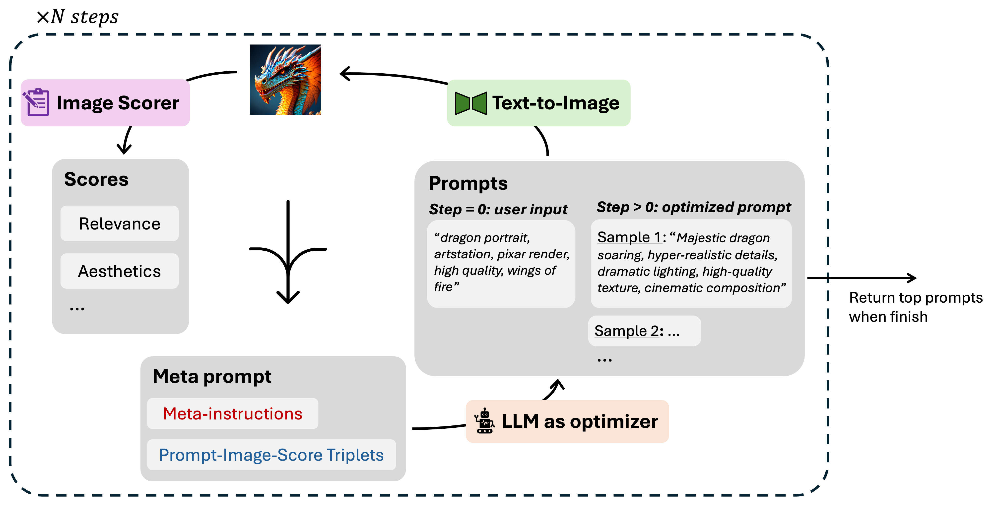

# Optimizing Prompts with Large Language Models for Text-to-Image Generation

This repository contains the code for CS546 NLP course project and is based on the repo from [Large Language Models as Optimizers, Yang et al., ICLR2024](https://arxiv.org/abs/2309.03409)

  

## Dependency requirements

The code has been verified to work under `Python 3.10.13` with the conda environment file included here [environment.yml](./environment.yml).

## Usage

### Prompt optimization 
Use `opro/optimization/optimize_instructions_T2I.py`. 

A quickstarter with default parameters (need diffusionDB dataset in ./data/diffusionDB/):

`
python optimize_instructions_T2I.py --openai_api_key="<your_openai_api_key>"
`

The run script [run.sh](./run.sh) is provided for more convenient manipulation of different settings and hyperparameters

## Precaution on API costs

Calling the PaLM or GPT APIs for prompt optimization and evaluation may incur unexpectedly large costs. Please carefully estimate the cost and/or start with lighter use (e.g., evaluate on a smaller portion of the benchmark dataset or run optimization for fewer steps) before the formal experimentations, or prompt self-served models instead.

